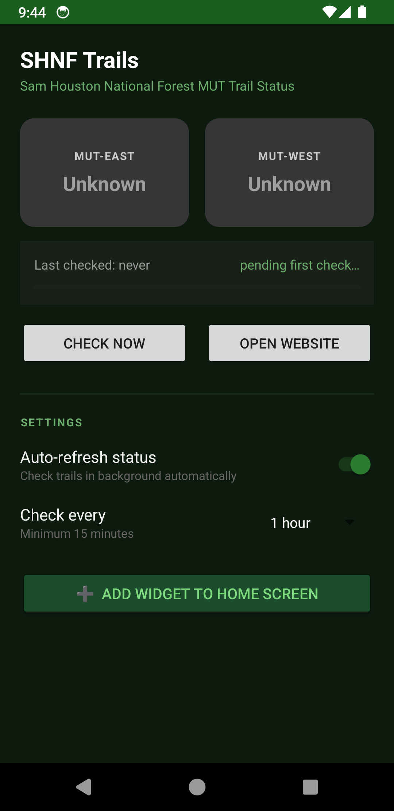
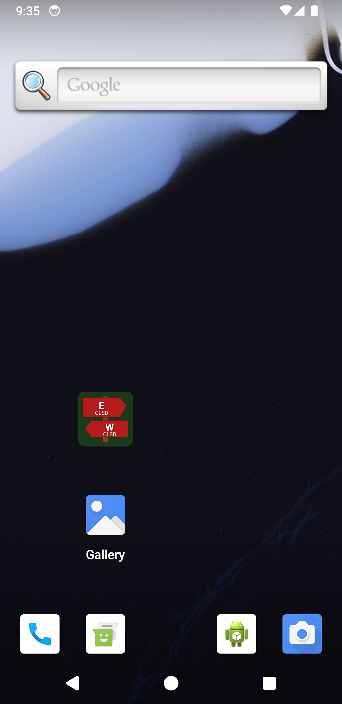
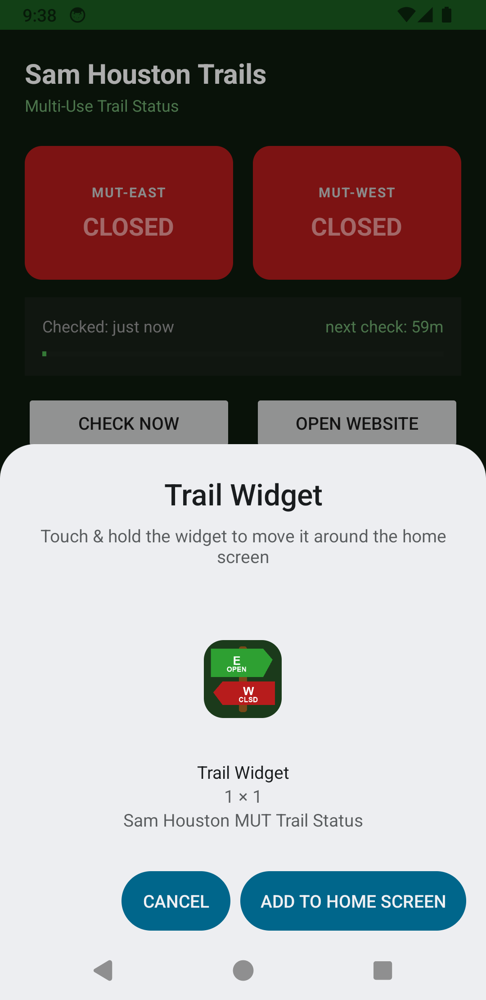
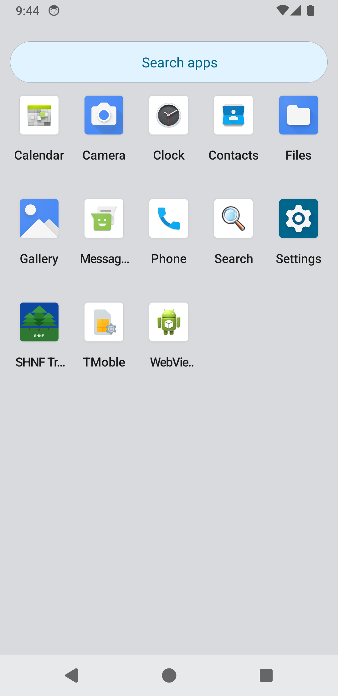

<div align="center">
  
  <h1>SHNF Trails</h1>
  <p><strong>Sam Houston National Forest — MUT Trail Status Widget for Android</strong></p>
  <p>
    
    
    
    
  </p>
</div>

---

A lightweight Android app and home screen widget that checks the status of the **Multi-Use Trail East (MUT-East)** and **Multi-Use Trail West (MUT-West)** in Sam Houston National Forest at [samhoustontrails.com](https://www.samhoustontrails.com) — no browser tab required.

The widget shows trail sign icons colored **green** (open), **red** (closed), or **grey** (unknown/stale), updating automatically in the background without draining your battery.

---

## Screenshots

<p align="center">
  
  &nbsp;&nbsp;
  
  &nbsp;&nbsp;
  
  &nbsp;&nbsp;
  
</p>

---

## Features

| | |
|---|---|
| 🪧 **Trail sign widget** | Home screen widget with **E** / **W** flags colored by live status |
| 🔴🟢⚫ **Status colors** | Green = open · Red = closed · Grey = unknown or data stale |
| 🔄 **Background auto-refresh** | WorkManager fires only when network is up and battery is not low |
| ⚙️ **Configurable interval** | 15 min · 30 min · 1 h · 2 h · 4 h |
| ⏱️ **Live timer** | Last-checked age + countdown to next check, refreshing every 30 s |
| 📌 **One-tap widget placement** | "Add Widget to Home Screen" triggers the system pin-widget dialog |
| 🌐 **Quick link** | Opens [samhoustontrails.com](https://www.samhoustontrails.com) in your default browser |
| 🌲 **Adaptive icon** | Forest / SHNF scene; follows your launcher's icon shape |
| 📐 **Responsive widget** | Bitmap redraws at actual cell dimensions; supports resize |

---

## How It Works

```
samhoustontrails.com
        │
        ▼
  TrailScraper          OkHttp + Jsoup
  (homepage first;      parses text around
   /closed-trail-status "MUT-East" / "MUT-West"
   only if needed)      for OPEN / CLOSED keywords
        │
        ▼
  StatusStore           SharedPreferences
  (persists statuses    marks data stale after
   + last-check time)   2 h of no updates
        │
        ▼
  Widget + App UI       RemoteViews bitmap drawn
                        with Canvas at actual
                        cell pixel dimensions
```

**Battery efficiency:**
- The scraper fetches the homepage first; the second URL is only requested if one or both statuses are still unknown after parsing the first page.
- WorkManager constraints: `NetworkType.CONNECTED` + `requiresBatteryNotLow(true)`.
- No polling — a single periodic job, rescheduled only when the user changes the interval.

---

## Project Structure

```
app/src/main/
├── java/com/trailwidget/
│   ├── TrailScraper.kt          # HTTP fetch + HTML parse → TrailStatuses
│   ├── StatusStore.kt           # SharedPrefs wrapper: status, timestamp, settings
│   ├── TrailUpdateWorker.kt     # WorkManager Worker — periodic background fetch
│   ├── TrailWidgetProvider.kt   # AppWidgetProvider — bitmap widget + WorkManager schedule
│   └── MainActivity.kt          # App UI: status cards, timer, settings, pin-widget
│
└── res/
    ├── layout/
    │   ├── activity_main.xml    # Main screen layout (dark green theme)
    │   └── widget_layout.xml   # Widget RemoteViews root
    ├── drawable/
    │   ├── widget_preview.png   # Static widget preview shown in picker
    │   └── ic_launcher_foreground.png  # Adaptive icon foreground (forest scene)
    ├── xml/widget_info.xml      # Widget metadata (API 29 baseline)
    ├── xml-v31/widget_info.xml  # Widget metadata override (API 31+ cell targeting)
    └── mipmap-*/ic_launcher*    # App icon at all densities
```

---

## Building from Source

### Prerequisites

| Tool | Minimum version |
|------|----------------|
| JDK | 11 |
| Android SDK | API 34 (compile), API 29 (min run) |
| Gradle | 8.4 (wrapper included) |

### Build

```bash
git clone https://github.com/YOUR_USERNAME/shnf-trails.git
cd shnf-trails
./gradlew assembleDebug
# APK → app/build/outputs/apk/debug/app-debug.apk
```

### Install via ADB

```bash
adb install app/build/outputs/apk/debug/app-debug.apk
```

---

## Tech Stack

| Concern | Library / API |
|---------|--------------|
| HTTP client | [OkHttp 4](https://square.github.io/okhttp/) |
| HTML parsing | [Jsoup](https://jsoup.org/) |
| Background work | [AndroidX WorkManager 2.9](https://developer.android.com/jetpack/androidx/releases/work) |
| Widget rendering | `AppWidgetProvider` + `Canvas` bitmap drawn at runtime |
| UI | `AppCompatActivity`, `SwitchCompat`, `Spinner`, `ProgressBar` |
| Min SDK | Android 10 (API 29) |
| Language | Kotlin |

---

## Permissions

```xml
<uses-permission android:name="android.permission.INTERNET" />
```

That's it — no location, no notifications, no background-location.

---

## Contributing

Pull requests welcome. Please keep the battery-efficiency contract intact:

- Don't add unnecessary network requests.
- Don't introduce polling loops or `AlarmManager` wakeups.
- Keep the scraper logic in `TrailScraper` and storage logic in `StatusStore` — don't scatter it across the codebase.

---

## License

```
MIT License

Copyright (c) 2025 SHNF Trails Contributors

Permission is hereby granted, free of charge, to any person obtaining a copy
of this software and associated documentation files (the "Software"), to deal
in the Software without restriction, including without limitation the rights
to use, copy, modify, merge, publish, distribute, sublicense, and/or sell
copies of the Software, and to permit persons to whom the Software is
furnished to do so, subject to the following conditions:

The above copyright notice and this permission notice shall be included in all
copies or substantial portions of the Software.

THE SOFTWARE IS PROVIDED "AS IS", WITHOUT WARRANTY OF ANY KIND, EXPRESS OR
IMPLIED, INCLUDING BUT NOT LIMITED TO THE WARRANTIES OF MERCHANTABILITY,
FITNESS FOR A PARTICULAR PURPOSE AND NONINFRINGEMENT. IN NO EVENT SHALL THE
AUTHORS OR COPYRIGHT HOLDERS BE LIABLE FOR ANY CLAIM, DAMAGES OR OTHER
LIABILITY, WHETHER IN AN ACTION OF CONTRACT, TORT OR OTHERWISE, ARISING FROM,
OUT OF OR IN CONNECTION WITH THE SOFTWARE OR THE USE OR OTHER DEALINGS IN THE
SOFTWARE.
```

---

<div align="center">
  <sub>Built for hikers, by hikers. 🌲 Not affiliated with Sam Houston National Forest or the Lone Star Hiking Trail Club.</sub>
</div>
